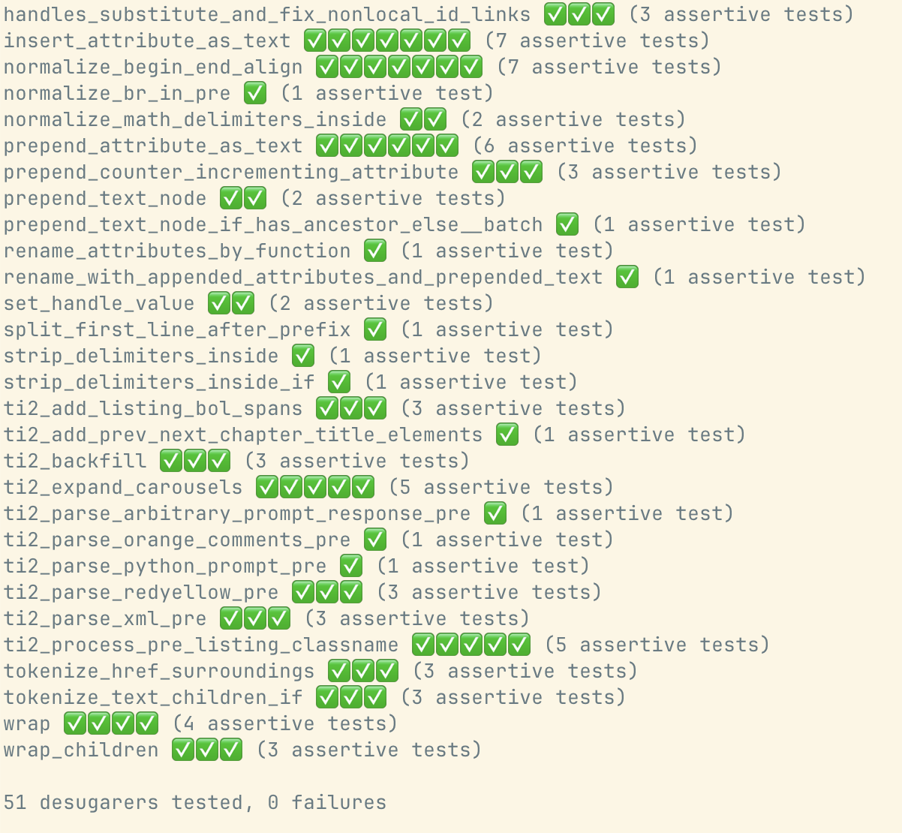

# TI2

## 1. Gleam Install

[Official instructions.](https://gleam.run/getting-started/installing)

## 2. Clone repos

Git clone the `vistuleB/wly` and `vistuleB/ti2` in same folder.

ssh

```
git clone git@github.com:vistuleB/wly.git
```
```
git clone git@github.com:vistuleB/ti2.git
```

https

```
git clone https://github.com/vistuleB/wly.git
```
```
git clone https://github.com/vistuleB/ti2.git
```

## 3. 'wly' test

1. `cd wly/desugaring`
3. `gleam run -m desugarers`

Various output should come out like this:



## 4. 'ti2' test

1. `cd ../ti2` or `cd ti2` (depending on location)
2. `rm public/*.html`
3. `gleam run`

Various messages from the desugaring engine (situated in `wly` repo) should print out and the `public/` folder should have its .html repopulated.

One can open the `index.html` inside the `public` folder directly inside a browser.

## 5. Source location

Author source is contained in `ti2/wly/` . Browse that directory to get an idea for the markup structure.

The `.wly` source files should be syntax highlighted.

Download ["Writerly"](https://marketplace.visualstudio.com/items?itemName=TabbyNotes.writerly-vscode-extension) for syntax highlighting.

## 6. Formatter

Run `gleam run -- --fmt` in `ti2` repo for default 55 to reformat at char per line formatting, `gleam run -- --fmt 65` to format line length to 65 chars per line, etc.

